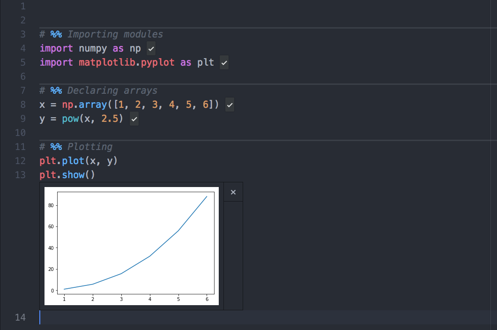

# hydrogen-cell-separator

## Description
Atom plugin that separates [Hydrogen](https://atom.io/packages/hydrogen) breakpoints (cells designated with # %%) with a horizontal line improving cell identification.

## Usage
Enabling / Disabling package.

## Acknowledgement
This package was mainly inspired by
[method-separator](https://atom.io/packages/method-separator)
developed by Koen Lageveen.

## Troubleshoot

### Issue 1: Breakpoints are not recognised
Currently, Atom is using [tree-sitter](https://github.com/tree-sitter/tree-sitter) (an incremental parsing system for programming tools) which creates a conflict detecting hydrogen breakpoints. As suggested in https://github.com/nteract/hydrogen/issues/1602#issuecomment-490512892, the easiest workaround is to disable tree-sitter in Settings >> Core.
